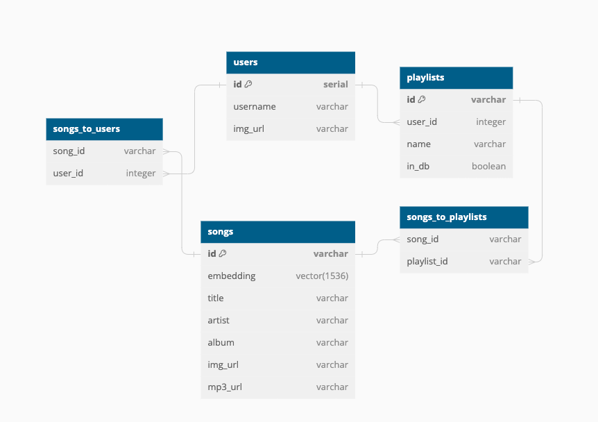

# GrooveGuru

# [GrooveGuru Live Site](https://grooveguru-react.vercel.app/)

# API DATA

- Personal backend API
- Spotify API
- Open ai API

# Database Outline

# Tech Stack

GrooveGuru is built using the following technologies:

- React
- Node.js
- Express
- PostgreSQL
- Tailwind CSS
- DaisyUI
- Jest

---

---

---

---

# GrooveGuru Flow/Features
GrooveGuru is an AI enhanced playlist generator.
It takes the music from your spotify account and embeds the details of each song
so that you can use AI to search through your music according to genre, feel, or mood of songs.
You can then create playlists according to your prompts and which songs you choose.

## Login Page

 You first login to GrooveGuru with your spotify account.
 This uses the spotify Oauth and Api
 After login user is redirected to welcome page.

## Welcome Page

 Here is the meat of GrooveGuru
 On this page you are given some directions how to use Groove Guru.
 Below the Directions you have a option select to choose which or all playlists to search from
 and then there is a search bar that will be waiting for a prompt. As you enter the prompt and 
 submit it will search through your songs according to the prompt and show the songs in 
 order according to relevance.

You can then listen to portions of each song and select by clicking on each song you would like then 
create a playlist with the selected songs.

There is also an option to download more of your playlists in the top right corner
as well as log out or delete your account in the top left corner.

# Tests

- you can run tests with `npm run test`
- test are located with models and routes in models file and route file

---

---

---

---

# GrooveGuru Backend API Documentation

## Music API

- Used to access and update users music and connections to playlists and users

## Spotify API

- Used to access and organize the data received from the actual spotify Api

